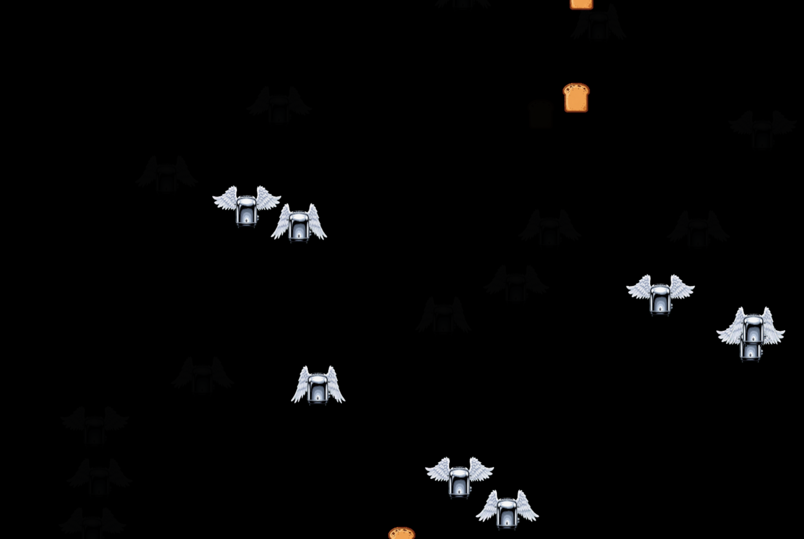

# Creating Retro Sprite Games with Claude Code, Gemini, and Veo 3



This article documents techniques for generating consistent, animated sprite graphics using Google's Gemini API (Imagen and Veo). The examples come from recreating the classic "Flying Toasters" screensaver from After Dark.

What makes this workflow unique: **we used Claude Code (an AI coding assistant) to iteratively develop and refine the Gemini prompts and processing pipeline.** This "AI-driving-AI" approach accelerates creative iteration significantly.

## The Challenge: Consistency Across Animation Frames

When generating sprites for games or animations, you need multiple frames that:
1. Maintain the **same character design** across all frames
2. Show **different poses or positions** (e.g., wing positions for flying)
3. Have **transparent backgrounds** for compositing

This is surprisingly difficult with AI image generation because each generation is independent—the model has no memory of previous outputs.

## Approach 1: Separate Image Generation (Failed)

The naive approach is generating each frame independently with pose-specific prompts.

```python
prompts = {
    "frame_0.png": "pixel art flying toaster, wings UP...",
    "frame_1.png": "pixel art flying toaster, wings MIDDLE...",
    "frame_2.png": "pixel art flying toaster, wings DOWN...",
}

for filename, prompt in prompts.items():
    response = client.models.generate_images(
        model="imagen-4.0-generate-001",
        prompt=prompt,
    )
```

**Result:** Each frame produced a completely different toaster design. The wings changed position, but so did the toaster's shape, color, proportions, and style.

**Why it fails:** Image generation models don't have "memory" between calls. Even with identical style descriptions, the random seed and model interpretation vary.

## Approach 2: Sprite Sheet Generation (Partially Worked)

Request all frames in a single image as a sprite sheet.

```python
prompt = """
A horizontal sprite sheet showing 6 frames of the same flying toaster,
pixel art style, each frame shows a different wing position in the
flapping cycle, consistent toaster design across all frames,
arranged left to right: wings up, wings mid-up, wings horizontal,
wings mid-down, wings down, wings mid-up
"""
```

**Result:** Better consistency, but the wing positions were often too similar. The model understood "sprite sheet" but didn't vary the poses enough for fluid animation.

**Why it partially works:** A single generation maintains internal consistency, but the model prioritizes making frames look similar over showing distinct poses.

## Approach 3: Video Generation + Frame Extraction (Success)

Generate a short video of the animation, then extract frames. Videos inherently maintain subject consistency while showing motion.

### Step 1: Generate Video with Veo

```python
from google import genai
from google.genai import types
import time

client = genai.Client(api_key=os.environ.get("GEMINI_API_KEY"))

prompt = (
    "A chrome silver retro toaster with white feathered angel wings "
    "flying through the air, wings flapping up and down in a smooth "
    "repeating animation cycle, side view profile, pixel art style, "
    "32-bit retro game aesthetic, bright solid green chroma key "
    "background (#00FF00), the toaster stays centered in frame while "
    "wings animate, classic 1990s After Dark flying toasters "
    "screensaver style"
)

operation = client.models.generate_videos(
    model="veo-3.1-generate-preview",
    prompt=prompt,
    config=types.GenerateVideosConfig(
        aspect_ratio="16:9",
        number_of_videos=1,
        duration_seconds=4,
    ),
)

# Poll for completion (video generation takes 1-2 minutes)
while not operation.done:
    time.sleep(10)
    operation = client.operations.get(operation)

# Download the result
result = operation.result
video = result.generated_videos[0]
client.files.download(file=video.video)
video.video.save("toaster_video.mp4")
```

### Step 2: Extract Frames with FFmpeg

```python
import subprocess

def extract_frames(video_path, output_dir, num_frames=8):
    """Extract evenly-spaced frames from video."""
    fps = num_frames / 4  # For a 4-second video

    cmd = [
        "ffmpeg", "-y",
        "-i", str(video_path),
        "-vf", f"fps={fps}",
        f"{output_dir}/frame_%03d.png"
    ]
    subprocess.run(cmd, capture_output=True)
```

**Why it works:** Video models are designed to maintain temporal consistency—the subject must look the same across frames while motion occurs naturally.

## Handling Transparency: The Green Screen Technique

AI models don't natively output transparent PNGs. The solution is requesting a solid-color background and removing it programmatically (chroma keying).

### Prompting for Green Screen

Include explicit green screen instructions in your prompt:

```
"bright solid green chroma key background (#00FF00)"
```

**Important:** AI models often interpret "green background" loosely. You may get:
- Bright chroma green (#00FF00) - ideal
- Muted sage green - common with video models
- Gradient or textured green - problematic

### Adaptive Chroma Key Removal

This algorithm handles both bright and muted greens:

```python
from PIL import Image

def remove_green_screen(image_path, output_path):
    """Remove green-dominant pixels and save with transparency."""
    img = Image.open(image_path).convert("RGBA")
    pixels = img.load()
    width, height = img.size

    for y in range(height):
        for x in range(width):
            r, g, b, a = pixels[x, y]

            # Calculate how much greener this pixel is than red/blue
            green_dominance = g - max(r, b)

            # Strong green = fully transparent
            if green_dominance > 20 and g > 100:
                pixels[x, y] = (0, 0, 0, 0)

            # Slight green tint = partial transparency (anti-aliasing)
            elif green_dominance > 5 and g > 80:
                alpha_factor = 1 - (green_dominance / 100)
                new_alpha = int(a * max(0, min(1, alpha_factor)))
                pixels[x, y] = (r, g, b, new_alpha)

    img.save(output_path, "PNG")
```

### Removing Black Backgrounds

For sprites generated with black backgrounds:

```python
def remove_black_background(image_path, output_path, threshold=15):
    """Remove near-black pixels."""
    img = Image.open(image_path).convert("RGBA")
    pixels = img.load()

    for y in range(img.height):
        for x in range(img.width):
            r, g, b, a = pixels[x, y]
            if r < threshold and g < threshold and b < threshold:
                pixels[x, y] = (0, 0, 0, 0)

    img.save(output_path, "PNG")
```

## Prompt Engineering for Pixel Art Sprites

### Effective Style Keywords

```
"pixel art style"
"32-bit retro game sprite"
"16-bit SNES style"
"clean pixel edges"
"no anti-aliasing"  # if you want hard edges
"classic 1990s video game aesthetic"
```

### Specifying Pose and Orientation

Be explicit about camera angle and pose:

```
"side view profile"
"three-quarter view"
"the character stays centered in frame"
"facing right"
```

### Avoiding Common Problems

Add negative constraints:

```
"no text, no labels, no diagrams"
"no watermarks"
"single character only"
"simple background"
```

### Complete Prompt Example

```python
prompt = (
    "A chrome silver retro toaster with white feathered angel wings "
    "flying through the air, wings flapping up and down in a smooth "
    "repeating animation cycle, "

    # Pose and framing
    "side view profile, the toaster stays centered in frame while "
    "wings animate, "

    # Style
    "pixel art style, 32-bit retro game aesthetic, "

    # Background for chroma key
    "bright solid green chroma key background (#00FF00), "

    # Reference and anti-garbage
    "classic 1990s After Dark flying toasters screensaver style"
)
```

## Loading Variable Frame Counts in Games

Design your game code to handle any number of frames:

```python
def load_animation_frames(sprites_dir, prefix="frame_"):
    """Dynamically load all available animation frames."""
    frames = []
    i = 0

    while True:
        path = sprites_dir / f"{prefix}{i}.png"
        if path.exists():
            img = pygame.image.load(str(path)).convert_alpha()
            frames.append(img)
            i += 1
        else:
            break

    return frames
```

### Creating Smooth Loops with Few Frames

If you have few frames (3-4), create a ping-pong animation:

```python
def create_pingpong_cycle(frames):
    """Convert [A, B, C] to [A, B, C, B] for smooth looping."""
    if 2 <= len(frames) <= 4:
        # Add reverse frames, excluding endpoints to avoid stuttering
        frames.extend(frames[-2:0:-1])
    return frames
```

## Summary: Recommended Workflow

1. **Use video generation** (Veo) for animated sprites—it maintains consistency
2. **Request green screen background** in your prompt for transparency
3. **Extract frames** at your desired frame rate with FFmpeg
4. **Apply chroma key removal** with tolerance for edge anti-aliasing
5. **Design loaders** that handle variable frame counts

## The Meta-Technique: Using Claude Code to Drive Gemini

One of the most powerful aspects of this project was using **Claude Code** (Anthropic's AI coding assistant) to orchestrate the entire Gemini workflow. This creates a rapid iteration loop that's faster than manual coding.

### Why AI-Driving-AI Works

Traditional workflow:
```
Human writes code → Run → View results → Human debugs → Repeat
```

Claude Code workflow:
```
Human describes goal → Claude writes code → Run → Claude views results → Claude iterates → Repeat
```

The key advantages:

1. **Instant code generation**: Describe what you want, get working code immediately
2. **Visual feedback loop**: Claude can view the generated sprites and assess quality
3. **Rapid debugging**: When Gemini returns errors (like unsupported parameters), Claude fixes them immediately
4. **Domain expertise**: Claude knows PIL, FFmpeg, and API patterns without looking them up

### Example Interaction Flow

Here's how the actual development session progressed:

**Step 1: Planning**
```
Human: "I want to generate flying toaster sprites with consistent design"

Claude: *Creates a plan document with three approaches:*
        - Separate image generation
        - Sprite sheet generation
        - Video generation with frame extraction
```

**Step 2: Implementation**
```
Human: "Let's try the video approach"

Claude: *Writes generate_video_sprites.py with:*
        - Veo API call
        - FFmpeg frame extraction
        - PIL chroma key removal
```

**Step 3: Error Handling**
```
*Script runs, Gemini returns error:*
"400 INVALID_ARGUMENT: dont_allow for personGeneration is not supported"

Claude: *Immediately edits the script to remove the unsupported parameter*
Claude: *Re-runs the script*
```

**Step 4: Visual Assessment**
```
*Video generates, frames extracted*

Claude: *Views the output images*
Claude: "The green background wasn't removed properly—the background
         is muted sage green rather than bright chroma key green.
         Let me fix the algorithm."

Claude: *Updates the chroma key function with adaptive thresholds*
Claude: *Reprocesses frames*
Claude: *Views results* "The transparency looks correct now."
```

**Step 5: Integration Testing**
```
Human: "The toasts still have a black box visible"

Claude: *Views toast.png, sees black background*
Claude: *Writes and runs a one-liner to remove black pixels*
Claude: "Fixed. The toast now has a transparent background."
```

### The Prompt Iteration Cycle

Claude Code excels at prompt engineering because it can:

1. **Generate initial prompts** based on your description
2. **View the results** directly (Claude is multimodal)
3. **Diagnose issues** ("The wings aren't varying enough between frames")
4. **Refine prompts** with specific adjustments
5. **Test again** immediately

Example prompt evolution:

```
# Version 1 (too generic)
"flying toaster with wings"

# Version 2 (added style)
"pixel art flying toaster with angel wings, retro game style"

# Version 3 (added consistency hints)
"pixel art flying toaster with angel wings, the toaster stays
centered in frame, side view profile, retro game style"

# Version 4 (added green screen for transparency)
"pixel art flying toaster with angel wings, the toaster stays
centered in frame, side view profile, bright solid green chroma
key background (#00FF00), retro game style"

# Version 5 (added motion description for video)
"A chrome silver retro toaster with white feathered angel wings
flying through the air, wings flapping up and down in a smooth
repeating animation cycle, side view profile, pixel art style,
32-bit retro game aesthetic, bright solid green chroma key
background (#00FF00), the toaster stays centered in frame while
wings animate, classic 1990s After Dark flying toasters
screensaver style"
```

Each iteration was tested and refined based on actual output—a process that took minutes with Claude Code versus hours of manual iteration.

### Practical Tips for AI-Driving-AI

1. **Describe the end goal**, not the implementation
   - Good: "Generate consistent sprite animation frames"
   - Bad: "Write a Python script that calls the Veo API"

2. **Let Claude see the outputs**
   - Claude can view images and assess quality
   - Say "check the generated frames" and Claude will read and analyze them

3. **Iterate verbally**
   - "The background removal isn't working" → Claude fixes it
   - "The wings don't move enough" → Claude adjusts the prompt

4. **Trust the error handling**
   - When APIs return errors, Claude reads and fixes them
   - No need to debug yourself unless you want to

5. **Commit incrementally**
   - Ask Claude to commit working versions
   - Easy to roll back if experiments fail

### Tools Used

- **Claude Code**: AI coding assistant (Anthropic)
- **Gemini Veo 3.1**: Video generation API (Google)
- **Gemini Imagen 4.0**: Image generation API (Google)
- **FFmpeg**: Video frame extraction
- **PIL/Pillow**: Image processing for chroma key
- **Pygame**: Game runtime for testing

## API Reference

- **Image Generation:** `imagen-4.0-generate-001`
- **Video Generation:** `veo-3.1-generate-preview` (or `veo-3.1-fast-generate-preview` for speed)
- **Documentation:** https://ai.google.dev/gemini-api/docs/video

## Try It Yourself

Want to generate your own flying toasters? Copy the ready-to-use prompt from **[PROMPT_FOR_SPRITE_GENERATION.md](PROMPT_FOR_SPRITE_GENERATION.md)** and paste it into Claude Code.

## Files in This Project

- `flying_toasters.py` - Pygame screensaver using the generated sprites
- `sprites/` - Generated sprite frames with transparency
- `PROMPT_FOR_SPRITE_GENERATION.md` - Ready-to-use prompt for Claude Code
